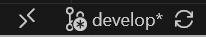
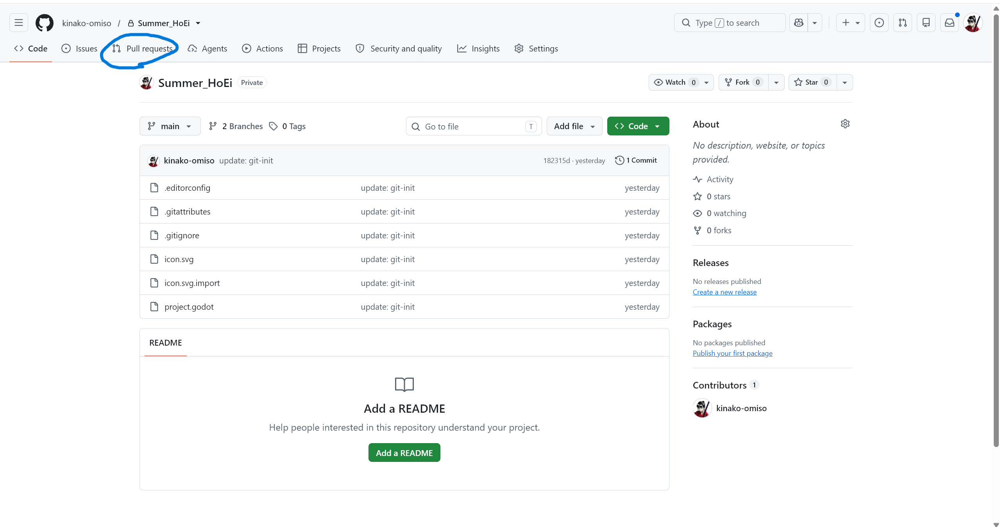
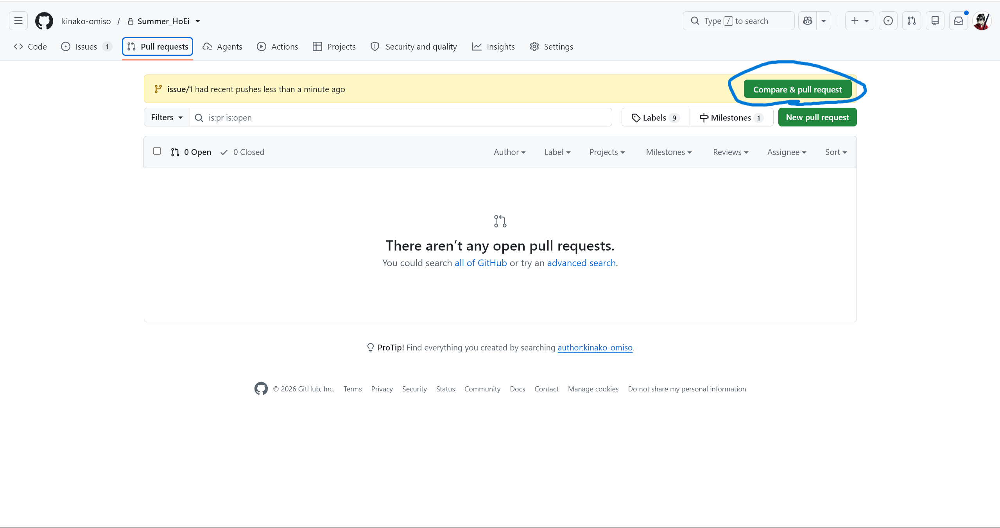

## ブランチ規則

- `develop` ブランチから、Issueごとに作業ブランチを作成する。
- ブランチ名は `issue/<Issue番号>` とする。例：Issue #48 の作業なら `issue/48`。
- 作業中の変更は作業ブランチへコミット・プッシュする。
- 作業完了後は、作業ブランチから `develop` へのPull Requestを作成する。
- `main` には、`develop` で動作確認を終えた安定版だけをマージする。
- `main` や `develop` へ直接コミット・プッシュしない。

### ブランチフロー

```text
main（安定版）
  └── develop（開発内容の統合先）
        ├── issue/1
        ├── issue/2
        └── issue/...
```

作業ブランチは `develop` から分岐し、Pull Requestで `develop` に戻します。リリースできる状態になったら、`develop` から `main` へマージします。

### ブランチ操作のコマンド

以下では、ブランチの作成と移動に `git checkout` を使います。

- 現在のブランチを確認する

    ```bash
    git branch --show-current
    ```

- `develop` から新しい作業ブランチを作成して移動する

    ```bash
    git checkout develop
    git pull --ff-only origin develop
    git checkout -b issue/48
    ```

    `-b` は、新しいブランチを作成して、そのブランチへ移動するオプションです。

- 既存のローカルブランチへ移動する

    ```bash
    git checkout issue/48
    ```

- リモートにだけ存在するブランチを、ローカルにも作成して追跡する

    ```bash
    git fetch origin
    git checkout -b issue/48 --track origin/issue/48
    ```

    ローカル側にも通常 `issue/48` という名前のブランチが作られ、`origin/issue/48` を追跡します。

> **`origin` とは**
> `origin` はリモートリポジトリそのものを表す特別な単語ではなく、リモート接続先につけられた名前です。`git clone` したときは、通常、複製元のリポジトリが `origin` という名前で登録されます。登録内容は `git remote -v` で確認できます。要するにリモートリポジトリを指す言葉としてoriginが使われています。

## コミットメッセージ

何を変更したか分かるように、Issue番号と作業内容を書いてください。

```text
#<Issue番号> <作業内容>
```

例：

```text
#48 化け物の移動を実装
```

作業途中なら、どこまで実装したか分かる内容にします。

```text
#48 プレイヤーを追跡する処理まで実装
```

Issue番号だけの `#48` よりも、変更内容を添えるほうが履歴を確認しやすくなります。

> **作業途中で交代・中断する場合**
> GitHubのIssueに、完了した内容・未完了の内容・確認が必要な点をコメントしておくと、次の人が作業を引き継ぎやすくなります。

### コミットのコマンド

- ステージング済みの変更をコミットする

    ```bash
    git commit -m "#48 化け物の移動を実装"
    ```

- 直前のコミットメッセージを書き直す

    ```bash
    git commit --amend -m "#48 化け物の移動を実装"
    ```

    すでにそのコミットをプッシュしている場合、履歴を書き換えるため通常の `git push` は拒否されます。自分専用の作業ブランチであることを確認してから、次を実行します。

    ```bash
    git push --force-with-lease origin issue/48
    ```

    `--force-with-lease` は、リモートに自分の知らない更新がある場合に上書きを止めます。共同作業中のブランチや `main`、`develop` では強制プッシュしないでください。

## 実際の作業の流れ

### 1. プロジェクトを開く

1. Godotでプロジェクトを開く。
2. Godotの「ファイルシステム」で任意の項目を右クリックし、「ターミナルで開く」を選ぶ。
3. 開いたターミナルで `code .` を実行し、VS Codeを開く。
4. VS Codeでターミナルを開く。ショートカットは環境によって異なるため、メニューの「ターミナル」→「新しいターミナル」でも開けます。

### 2. `develop` を最新にする

```bash
git checkout develop
git pull --ff-only origin develop
```

`git pull` は、リモートの変更を取得したあと、現在のブランチへ統合するコマンドです。引数なしの `git pull` は、現在のブランチに追跡先が設定されている場合、その追跡先から変更を取り込みます。

`git pull origin issue/5` のように別のブランチを指定すると、現在いるブランチへ `origin/issue/5` の内容を統合します。意図せぬマージを避けるため、通常の作業では取り込み先のブランチへ移動してから `git pull` してください。

`--ff-only` を指定すると、履歴が分岐していて単純に更新できない場合は自動マージせず停止します。停止した場合は、無理に進めず状況を確認してください。なにかあればきなこのお味噌汁に聞いてください。

### 3. 作業ブランチを用意する

新しいIssueを始める場合：

```bash
git checkout -b issue/48
```

すでにローカルに作業ブランチがある場合：

```bash
git checkout issue/48
git pull
```

リモートにだけ作業ブランチがある場合：

```bash
git fetch origin
git checkout -b issue/48 --track origin/issue/48
```

### 4. ブランチを確認して作業する

```bash
git branch --show-current
```

VS Codeの左下でも現在のブランチを確認できます。



作業にはいる。
作業最高！作業最高！

### 5. 変更内容を確認してステージングする

まず、変更されたファイルを確認します。

```bash
git status
git diff
```

必要な変更をステージングします。リポジトリのルートで、すべての変更を対象にする場合は次を実行します。

```bash
git add .
```

特定のファイルだけを対象にする場合：

```bash
git add <ファイル名>
```

`git add .` の `.` は現在のディレクトリを表します。現在のディレクトリ以下にある変更が対象になるため、実行前後に `git status` で対象を確認してください。`code .` の `.` も同様に現在のディレクトリを表します。

ステージングした内容は次で確認できます。

```bash
git diff --staged
```

### 6. コミットする

```bash
git commit -m "#48 化け物の移動を実装"
```
### 7. リモートへプッシュする
コミットを確認後、リモートにプッシュします。<br>
そのブランチを初めてプッシュする場合：

```bash
git push -u origin issue/48
```

`-u` をつけると、ローカルの `issue/48` とリモートの `origin/issue/48` が追跡関係になります。2回目以降は以下のコマンドだけでプッシュできます。

```bash
git push
```

> **注意**ここから先は、そのIssueの作業が完了した場合に行います。

### 8. Pull Requestを作成する

1. GitHubでリポジトリを開き、「Compare & pull request」をクリックする。

    

    

2. マージ先（base）が `develop`、作業元（compare）が `issue/48` になっていることを確認する。`main` をマージ先にしない。
3. Milestoneを該当するIssueのものに設定する。
4. Pull Requestの説明にIssue番号（例：`#48`）と、変更内容・確認方法を書く。
5. 「Create pull request」をクリックする。

    

### 9. 内容を確認してマージする

次を確認してから「Merge pull request」→「Confirm merge」を実行します。

- GitHub上で競合（conflict）が表示されていない。
- 自動チェックがある場合は成功している。
- Godotで必要な動作確認が完了している。
- マージ先が `develop` になっている。

競合や赤いエラーが表示された場合、内容が分からないままマージせず、担当者へ相談してください。


### 10. Issueを閉じる

マージが完了したらGitHubのIssueを開き、マージ完了のコメントを残してCloseします。

作業ブランチが不要になった場合は、GitHub上の「Delete branch」でリモートブランチを削除できます。ローカルブランチを削除するときは、`develop` へ移動してから実行します。

```bash
git checkout develop
git pull --ff-only origin develop
git branch -d issue/48
```
